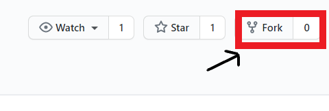

# Lab Chat
A GUI message app for chatting with your Friends

If you are new to open-source and don't know how to use this then follow the steps below:

Step 1:Install git on your Mac or PC,[by clicking here]( https://help.github.com/articles/set-up-git/).
Step 2: Click on the fork button to create a copy of this repository on your account.

Step 3: Now to get code on your machine, you have to clone the repository. Click on code.

Step 4: Now click on the clipboard button.

Step 5: Open a terminal and run the this git command using the following format
git clone https://github.com/(Your Github username)/Lab-Chat.git

Good to go. Now you all this code in your pc. Have fun!
